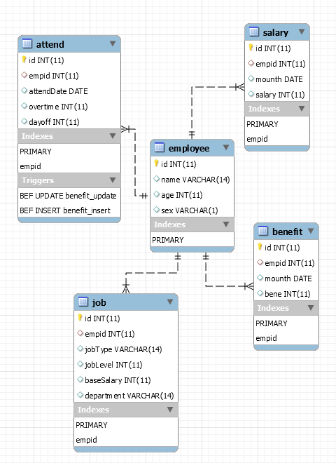

# 工资管理系统(SimpleEmployeeSystem)

## 1、快速开始

### 系统依赖：

>JavaSE-1.7</br>
>MySQL Community Server Version5.5.52</br>
>Apache Tomcat 8.5.13</br>

下载源码编译之后放入tomcat/webapps目录下并启动tomcat/bin/startup.bat即可


## 2、系统功能的基本要求：</br>

员工(employee)每个工种(job)基本工资(baseSalary)的设定；</br>
>使用表job,手动录入工种(job)和基本工资(baseSalary)</br>

加班津贴(benefit)管理，根据加班时间(overtime)和类型给予不同的加班津贴；</br>
>在执行AttendService.addAttend和AttendService.editAttend在插入/修改考勤记录的同时会自动插入/修改一条对应的benefit记录，该操作由mysql中的2个触发器来实现</br>

按照不同工种(job)的基本工资(baseSalary)情况、员工的考勤情况(attend)产生员工的每月的月工资；</br>
>在执行AttendService.addAttend和AttendService.editAttend在插入/修改考勤记录的同时会自动插入/修改一条对应的salary记录，该操作由mysql中的2个触发器来实现</br>

员工年终奖金的生成，员工的年终奖金计算公式＝（员工本年度的工资总和＋津贴的总和）/12；</br>
>使用Award作为Bean。没有保存到数据库，因为其数据可使用其它的表生成</br>

能够查询单个员工的工资情况、每个部门的工资情况、按月的工资统计；</br>
>单个员工的工资情况(QueryEmployeeSalary.jsp)</br>
>每个部门的工资情况(QueryDepartmentSalary.jsp)</br>
>按月的工资统计(QuerySalaryByDate.jsp)</br>

## 3、数据库要求：



1.employee员工基本信息表(BCNF)；</br>

```sql
--id 工号
--name 员工姓名
--age 年龄
--sex 性别
CREATE TABLE employee(
id int primary key auto_increment,
name VARCHAR(14),
age int,
sex VARCHAR(1)
);
```

2.attend员工考勤情况表(BCNF)：出勤时间、出勤类型、employee</br>

```sql
--empid 工号
--attendDate 出勤日期
--overtime 加班天数
--dayoff 请假天数
CREATE TABLE attend(
id int primary key auto_increment,
empid int,
attendDate DATE,
overtime int,
dayoff int,
key empid (empid),
foreign key (empid) references employee(id)
);
```

3.benefit员工津贴信息表(BCNF)，反映员工的加班时间，加班类别、加班天数、津贴情况等：出勤时间、出勤类型、employee</br>

```sql
--empid 工号
--mounth 该月加班记录
--bene 初始为0 该月津贴 每次+200
CREATE TABLE benefit(
id int primary key auto_increment,
empid int,
mounth DATE, 
bene int,
key empid (empid),
foreign key (empid) references employee(id)
);
```

4.job员工工种情况表(2NF)，反映员工的工种、等级，基本工资等信息；employee</br>

```sql
--empid 工号
--jobType 工种(BOSS老板:100000,PROGRAMMER程序员:10000,CLERK文员:5000)
--department 部门(develop,core)
--jobLeve 等级(1,2,3,4)
--baseSalary 基本月工资(单位：元)
CREATE TABLE job(
id int primary key auto_increment,
empid int,
jobType VARCHAR(14),
jobLevel int,
baseSalary int,
department VARCHAR(14),
key empid (empid),
foreign key (empid) references employee(id)
);
```

5.salary员工月工资表(BCNF)。</br>

```sql
--empid 工号
--mounth 月份 2017-04-01
--salary 基本月工资
CREATE TABLE salary(
id int primary key auto_increment,
empid int,
mounth DATE,
salary int,
key empid (empid),
foreign key (empid) references employee(id)
);
```

5.触发器(trigger)
分别是在添加出勤记录时触发，同时也添加对应月份的津贴表项和月工资表项。和在修改出勤记录时触发，同时也修改对应月份的津贴表项和月工资表项。</br>

```sql
--定义触发器
drop trigger if exists attend_insert;
drop trigger if exists attend_update;
--增加attend记录同时增加benefit,salary记录
delimiter $
create trigger attend_insert before insert on attend
for each row
begin
    declare base int;
    --
    insert into benefit(empid,mounth,bene) values (new.empid,new.attendDate,new.overtime*200);
    --
    set base=(select baseSalary from job where empid=new.empid)-new.dayoff*200;
    insert into salary(empid,mounth,salary) values (new.empid,new.attendDate,base);
end;
$
--修改attend记录同时修改benefit,salary记录
create trigger attend_update before update on attend
for each row
begin
    declare base int;
    --
    update benefit
    set bene=new.overtime*200
    where empid = new.empid and mounth=old.attendDate;
    --
    set base=(select baseSalary from job where empid=new.empid)-new.dayoff*200;
    update salary
    set salary=base
    where empid = new.empid and mounth=old.attendDate;
end;
$

delimiter ;
```